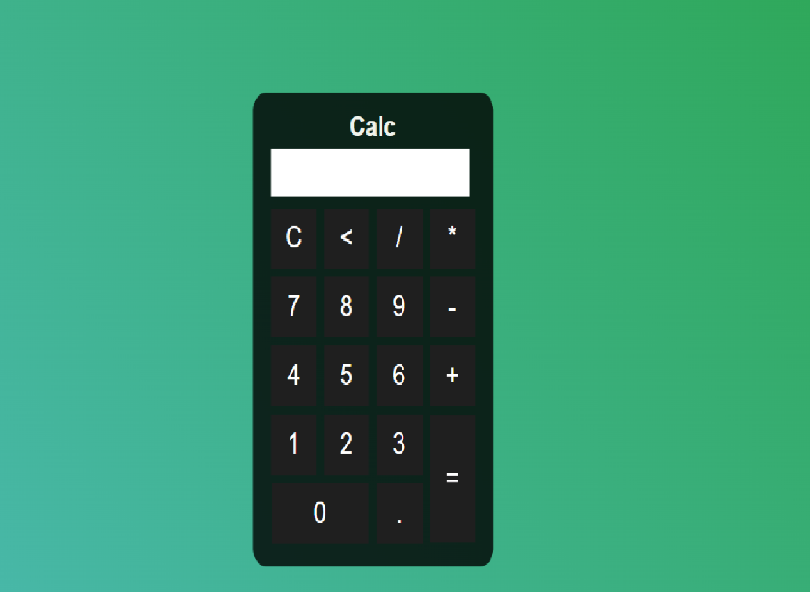

# Calculadora

Calculadora com funções simples.

## 🔨 Funcionalidades do projeto

Calculadora com funções simples que realiza calculos.

## ✔️ Técnicas e tecnologias utilizadas

-`HTML`
-`CSS`
-`Javascript`

## 🛠️ Abrir e rodar o projeto

Para abrir e rodar o projeto, utilize um editor de código de sua escolha.
Depois, abra o projeto no seu navegador.

## 📚 Mais informações

O objetivo do projeto é aperfeiçoar as habilidades em javascript.

## VERCEL

https://calculadora-xi-pied.vercel.app/
